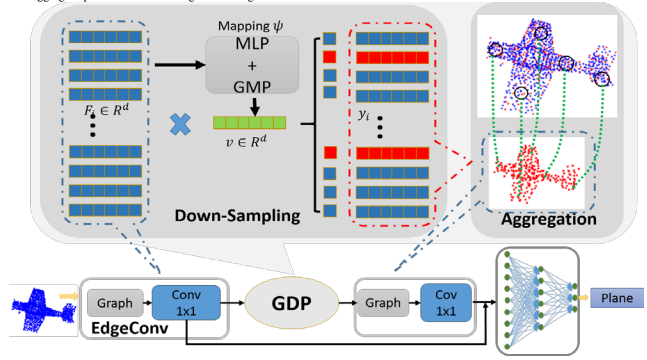

# GDS

This repo is for paper **[GDS:Global Description Guided Down-Sampling for 3D 
Point Cloud Classification](https://www.researchgate.net/publication/349828010_GDS_Global_Description_Guided_Down-Sampling_for_3D_Point_Cloud_Classification)**

<p float="left">
    
</p>

## Requirements
- Python 3.7
- PyTorch 1.2
- CUDA 10.0
- Package: glob, h5py, sklearn

## Point Cloud Classification

### ModelNet
#### Run the training script:

``` 
python main_cls.py --base_dir $Your Base Dir$ --exp_name=cls_1024 --num_points=1024 --k=20 --cd_weights 0.1
```

#### Run the evaluation script after training finished:

``` 
python main_cls.py --base_dir $Your Base Dir$ --exp_name=cls_1024_eval --num_points=1024 --k=20 --eval=True --model_path=$Your Model Path$
```

### ScanObjectNN
#### Run the training script:

``` 
python main_scan.py --base_dir $Your Base Dir$ --exp_name=scan_bg_1024 --num_points=1024 --k=20 --cd_weights 1.0
```

#### Run the evaluation script after training finished:

``` 
python main_scan.py --base_dir $Your Base Dir$ --exp_name=scan_bg_1024_eval --num_points=1024 --k=20 --eval=True --model_path=$Your Model Path$
```

## Citing GDS
If you find this repo useful, consider citing GDS use the following format,

_ACM Reference format:
Jiahua Wang, Yao Zhao, Ting Liu and Shikui Wei. 2020. 
GDS:Global Description Guided Down-Sampling for 3D Point 
Cloud Classification. In Proceedings of 2020 4th International 
Conference on Vision, Image and Signal Proceeding (ICVISP
2020), December 9-11, 2020, Bangkok, Thailand. ACM, New 
York, NY, USA, 7 pages._

## Acknowledgement
This repo is based upon [dgcnn.pytorch](https://github.com/AnTao97/dgcnn.pytorch).

